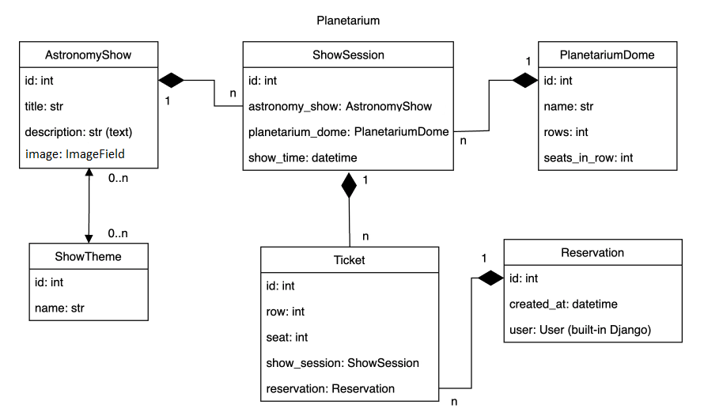
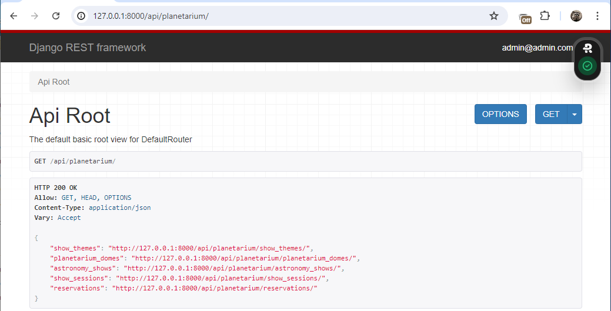
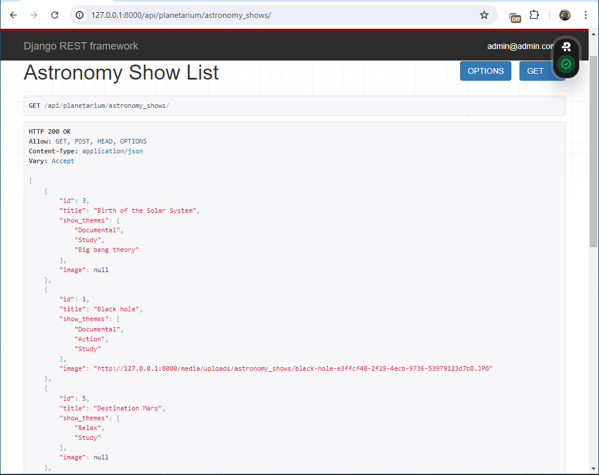
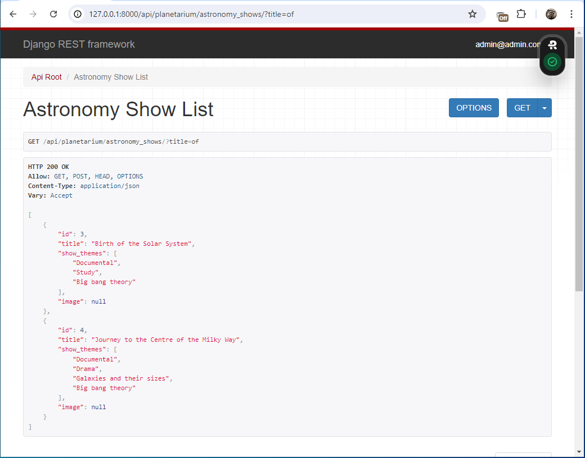
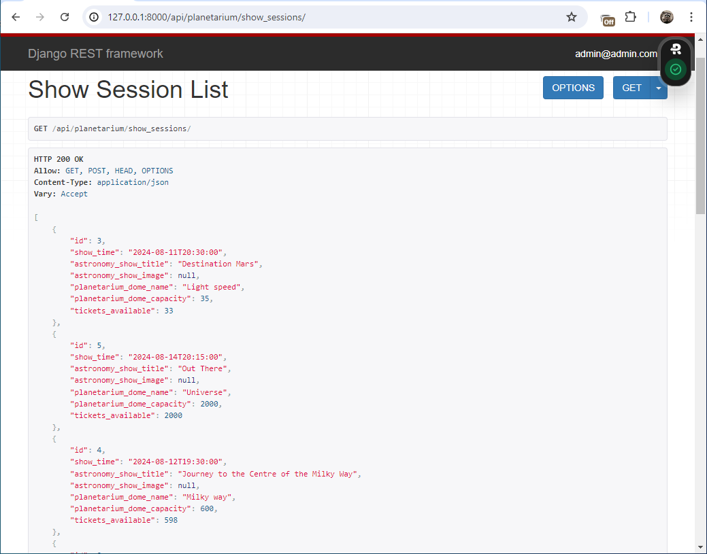
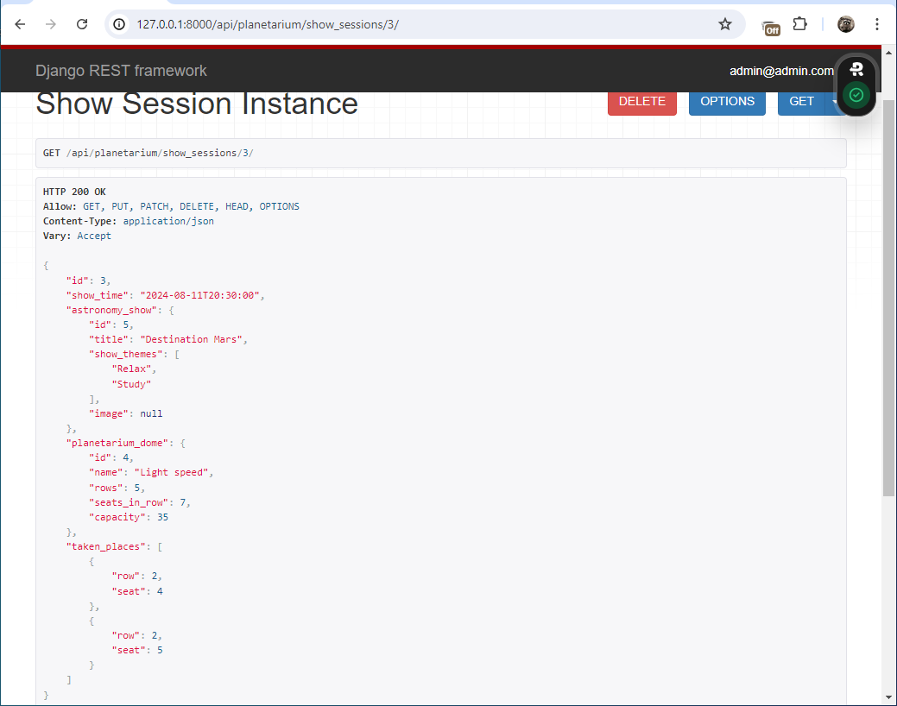
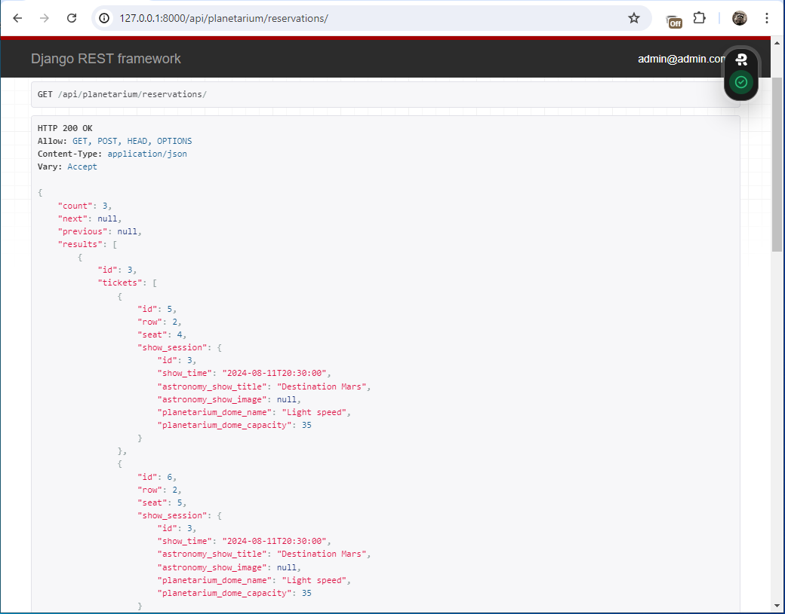
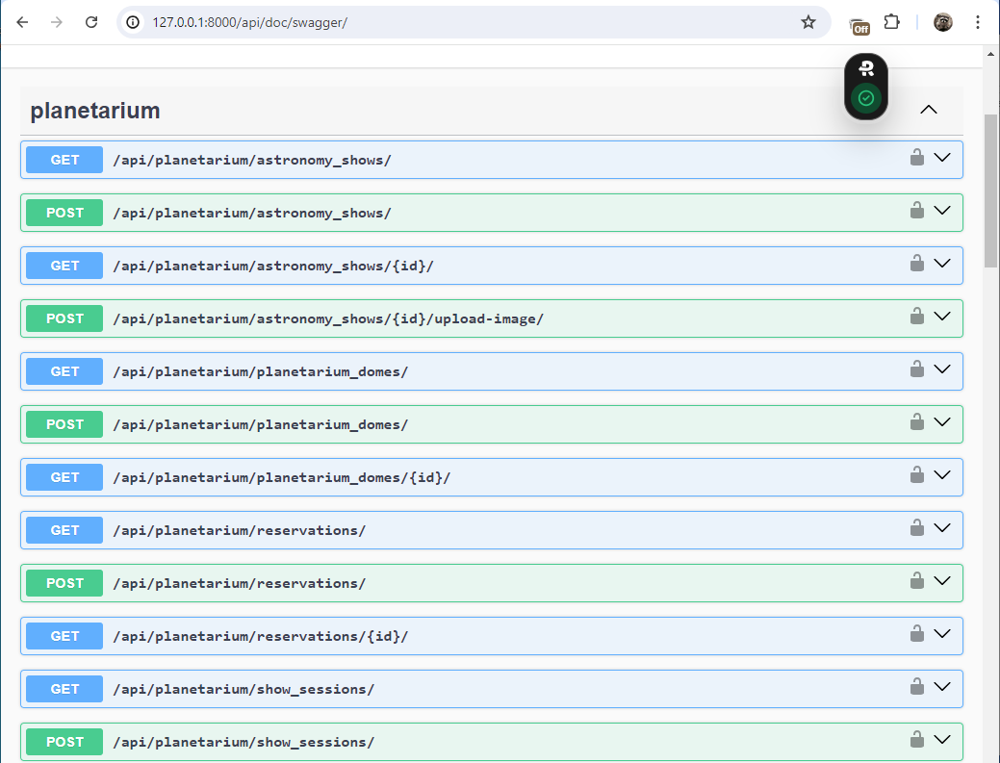

# Planetarium-api-service
Project for managing Planetarium API service with powerful Django REST Framework API. Manage your Planetarium Service from user registration to ticket sales and many functionality in between.

### Main features

* User registration and logging are implemented

* JWT authenticated

* Admin panel `/admin/`

* Documentation at `/api/doc/swagger/`

* Managing reservations and tickets

* Creating astronomy shows with show themes

* Uploading images for astronomy shows

* Creating planetarium domes

* Adding show sessions

* Filtering astronomy shows by title and data

* Filtering show sessions by show time and astronomy shows

* PostgreSQL database

* The project contains 6 models:

# Setup

### 1. Clone project from GitHub to local computer.

Open the Git Bash console in the directory where you want to place the project. Run command:

    git clone git@github.com:V-Shkrobatskyi/planetarium-api-service.git

### 2. Create virtual environment

Open the project and run command:

    python -m .venv venv

And activate virtualenv:

a) For windows:

    source .venv\Scripts\activate

b) For mac:

    source .venv/bin/activate
      

### 3. Installing project dependencies

Run command:

    pip install -r requirements.txt

### 4. Adding a secret key to the project

Generate a new secret key:

    python -c "from django.core.management.utils import get_random_secret_key; print(get_random_secret_key())"

Rename `.env.sample` file to `.env`. Open it and replace `<YOUR_DJANGO_SECRET_KEY>` with generated key.

### 5. Adding Database Settings

Enter database info in `.env` file:

    POSTGRES_PASSWORD=<YOUR_POSTGRES_PASSWORD>
    POSTGRES_USER=<YOUR_POSTGRES_USER>
    POSTGRES_DB=<YOUR_POSTGRES_DB>
    POSTGRES_HOST=<YOUR_POSTGRES_HOST>
    POSTGRES_PORT=<YOUR_POSTGRES_PORT>

### 6. Run with docker

Install Docker. Run these commands:

    docker-compose build
    docker-compose up

### 7. Go into a Docker container's shell

To enter in your Docker container's shell, you need to know `CONTAINER ID`.
Use the command in the terminal:

    docker ps

It shows container's info. Use command to enter inside the container:

    docker exec -it XXXXXXXXXXXX bash

where `XXXXXXXXXXXX` is `CONTAINER ID` of `planetarium-api-service-planetarium` container.
Now you can run commands inside container.

### 8. Run tests

To make sure that the project is working correctly, run the tests with the command:

    python manage.py test 

### 9. Load data into database:

To fill the database, load the `.json` file with the command:

    python manage.py loaddata planetarium_db.json

### 10. Getting access

To getting access to all resources you need to generate a token. To do this you need to go to:

    http://127.0.0.1:8000/api/user/token/

Enter credentials:
* Email - `admin@admin.admin`
* Password - `6rbK7NhGay8y`

Now you can use "access" token with **ModHeader** or **Requestly** plugin for example.

You can visit these pages:

    http://127.0.0.1:8000/api/planetarium/
with planetarium api root:

    http://127.0.0.1:8000/api/planetarium/astronomy_shows/
with astronomy shows list:

    http://127.0.0.1:8000/api/planetarium/astronomy_shows/?title=of
with astronomy shows list with title filter:

    http://127.0.0.1:8000/api/planetarium/show_sessions/
with show sessions list:

    http://127.0.0.1:8000/api/planetarium/show_sessions/3/
with show session detail:

    http://127.0.0.1:8000/api/planetarium/reservations/
with reservations list:

    http://http://127.0.0.1:8000/api/doc/swagger/
with documentation swagger:

You can explore the test data with other credentials:

* Email - `luisa@test.com`
* Password - `123qweASDrty`

or

* Email - `john.smith@test.com`
*  Password - `123qweASDrty`
